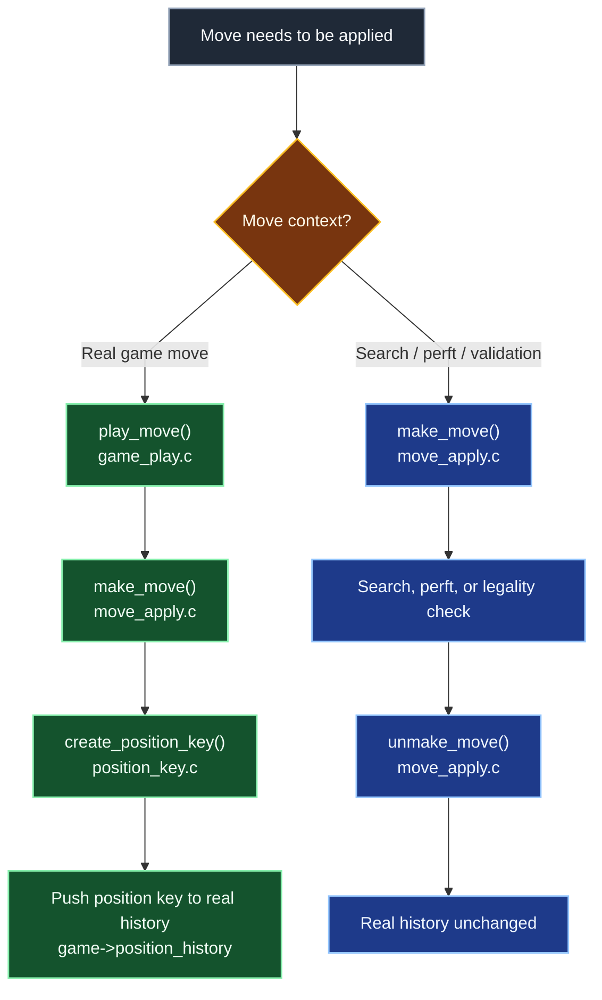
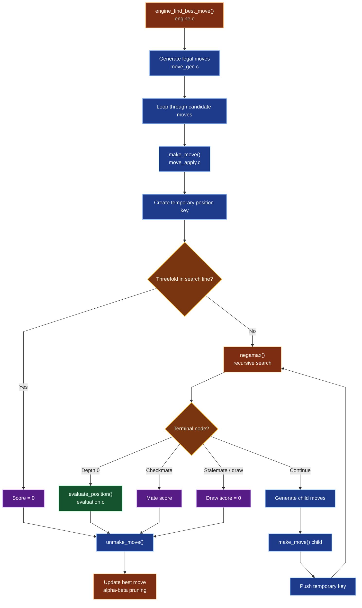
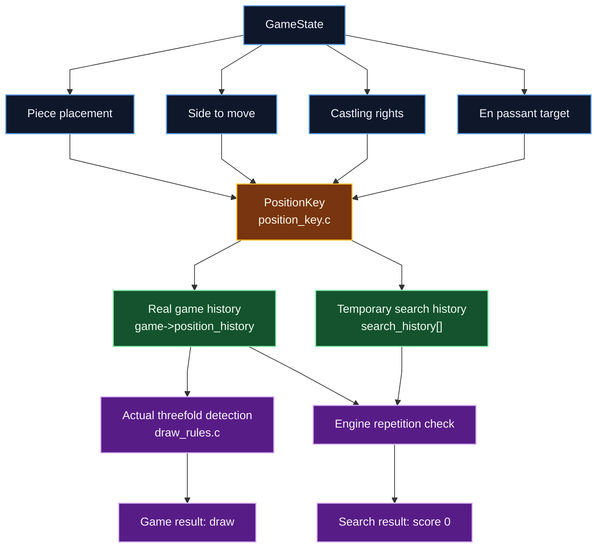
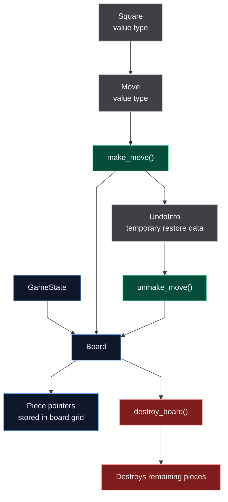

# Architecture

This document maps the main modules in the chess engine and explains how game state, move generation, move application, search, draw detection, position keys and notation parsing fit together.

The most important distinction in the codebase is:

- **Real game moves** go through `play_move()`
- **Search/perft moves** go directly through `make_move()` / `unmake_move()`

This keeps real game history separate from temporary engine search state.

---

## Real Moves vs Search Moves

Real moves and search moves use the same underlying move application system, but they have different responsibilities.

Real game moves must update the board, game metadata and repetition history. Search moves must be reversible and must not modify real game history.

`play_move()` is a wrapper for real game moves. It calls `make_move()` and then records the resulting position key in `game->position_history`.

Search, perft and temporary legality checks call `make_move()` / `unmake_move()` directly. They must not call `play_move()` because that would pollute the real game history with positions that were only analysed temporarily.

---

## Search Engine Pipeline

The engine currently uses negamax with alpha-beta pruning. Each candidate move is made on the board, searched recursively, then unmade to restore the original state.

The engine evaluates each node from the perspective of the side to move, then negates scores when returning to the previous ply.

Search uses a temporary position-key history for the current analysed line. This allows the engine to detect repeated positions during search without modifying the real game history.

---

## Position Keys and Repetition

A `PositionKey` identifies a chess position for repetition detection and repetition-aware search.

It represents:

- Piece placement
- Side to move
- Castling rights
- En passant target

It intentionally does not represent:

- Halfmove clock
- Fullmove number
- Move text

This matches the information needed to decide whether two positions are the same for threefold repetition.

There are two kinds of position history:

| History | Stored in | Purpose |
|---|---|---|
| Real game history | `game->position_history` | Detect threefold repetition in the actual played game |
| Search line history | `search_history[]` inside `engine.c` | Detect repetition inside temporary engine analysis |

The search history only applies to the current branch being analysed. It is not stored permanently.

---

## Ownership Model

The board owns the pieces stored in its grid. Moves and squares are value types. Search uses `UndoInfo` to restore captured pieces and previous game metadata after temporary moves.

`make_move()` moves existing `Piece *` pointers between board squares. It does not allocate a new piece for normal moves. Captured pieces are stored in `UndoInfo` so `unmake_move()` can restore them during search.

When the board is destroyed, it destroys any pieces still present in the grid.

---

## Module Layers

| Layer | Modules | Responsibility |
|---|---|---|
| Application | `main.c` | CLI loop, human input, engine turn handling |
| Input / Notation | `fen_parser.c`, `san_parser.c`, `san.c`, `san_resolve.c` | Load FEN positions and convert SAN input into concrete moves |
| Game State & History | `game_state.c`, `game_play.c`, `position_key.c` | Store game metadata, apply real moves and track repetition history |
| Chess Rules | `move_gen.c`, `move_apply.c`, `check_rules.c`, `draw_rules.c` | Generate legal moves, make/unmake moves, detect check/checkmate/stalemate and draws |
| Engine | `engine.c`, `evaluation.c` | Search legal moves using negamax/alpha-beta and evaluate positions |
| Core Data | `board.c`, `piece.c`, `move.c`, `square.c` | Define and manage the core chess data structures |
| Debug / Utilities | `debug_print.c`, `linked_list.c`, `queue.c` | Debug output and generic helper structures |

---

## Future Direction

The current architecture is intentionally simple and pointer-based. Future engine improvements such as move ordering, iterative deepening, quiescence search, Zobrist hashing, transposition tables and bitboards can be added without changing the high-level module boundaries.

For example:

- Move ordering can extend `engine.c` or become a separate `move_ordering.c` module.
- Zobrist hashing can replace or accelerate `position_key.c`.
- Transposition tables can sit beside the engine layer and use position keys.
- UCI support can be added as a new application-layer entry point beside `main.c`.