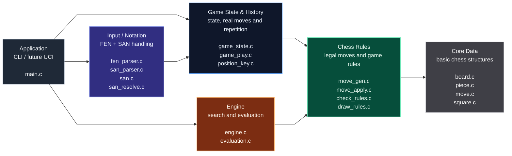

# Chess Engine in C

A chess engine written from scratch in C. The project currently supports legal move generation, FEN loading, SAN move resolution, reversible move application, perft testing, draw detection and a basic negamax engine with alpha-beta pruning.

---

## Why This Project

I started this project to re-explore chess programming from the ground up, this time from a lower-level perspective in C and with a stronger focus on software architecture than my older Python chess engine.

The goal is to build a properly tested and modular chess engine that conforms to the UCI protocol before delving into more advanced chess techniques such as bitboards, transposition tables, iterative deepening and NNUE-style evaluation.

This project is also a deliberate rebuild of ideas from my older [Python chess engine](https://github.com/W1lli4mP/Chess-NEA), with more emphasis on correctness, testing and maintainable architecture.

---

## Features

| Category | Details |
|---|---|
| Board Model | 8x8 board representation with owned `Piece *` pointers |
| FEN Parser | Loads full FEN state: board, side to move, castling rights, en passant target, clocks |
| Move Generation | Generates legal moves including checks, pins, castling, promotion and en passant |
| Move Application | Reversible `make_move` / `unmake_move` system using `UndoInfo` |
| SAN Input | Parses and resolves algebraic notation such as `e4`, `Nf3`, `exd5`, `O-O`, promotions |
| Perft Testing | Validates legal move generation against known perft positions |
| Draw Rules | Fifty-move rule, insufficient material and threefold repetition |
| Position Keys | Position identity system for repetition detection and repetition-aware search |
| Engine | Negamax search with alpha-beta pruning and repetition-aware scoring |
| Debugging | Optional compile-time engine debug output |
| Tests | Dedicated test binaries for FEN, move generation, move application, SAN and perft |

---

## Architecture

### Top-level diagram


For a deeper explanation of the real-move pipeline, search pipeline, ownership rules and repetition handling, see [ARCHITECTURE.md](ARCHITECTURE.md).

Each layer is separated into focused modules:

| Layer | Modules | Responsibility |
|---|---|---|
| Application | `main.c` | CLI loop, human input, engine turn handling |
| Input / Notation | `fen_parser.c`, `san_parser.c`, `san.c`, `san_resolve.c` | Load FEN positions and convert SAN input into concrete moves |
| Game State & History | `game_state.c`, `game_play.c`, `position_key.c` | Store game metadata, apply real moves and track repetition history |
| Chess Rules | `move_gen.c`, `move_apply.c`, `check_rules.c`, `draw_rules.c` | Generate legal moves, make/unmake moves, detect check/checkmate/stalemate and draws |
| Engine | `engine.c`, `evaluation.c` | Search legal moves using negamax/alpha-beta and evaluate positions |
| Core Data | `board.c`, `piece.c`, `move.c`, `square.c` | Define and manage the core chess data structures |
| Debug / Utilities | `debug_print.c`, `linked_list.c`, `queue.c` | Debug output and generic helper structures |

---

## Prerequisites

- C compiler with C99 support or later
- `make`
- `valgrind` for memory-checking targets

---

## Supported Notation

The CLI currently accepts SAN-style move input for the human side.

| Input | Meaning |
|---|---|
| `e4` | Pawn move |
| `Nf3` | Piece move |
| `exd5` | Pawn capture |
| `Nbd2` | Disambiguated piece move |
| `O-O` | Kingside castling |
| `O-O-O` | Queenside castling |
| `e8=Q` | Promotion |

FEN strings are supported for loading complete game states in tests and parser utilities.

---

## Usage

### Build

```bash
make
```

### Run

```bash
make run
```

### Run All Tests

```bash
make test
```

### Run Individual Tests

```bash
make run_fen
make run_move_gen
make run_move_apply
make run_san_resolve
make run_perft
```

### Run With Engine Debug Output

```bash
make run_engine_debug
```

### Run Valgrind

```bash
make valgrind_fen
make valgrind_move_gen
make valgrind_move_apply
make valgrind_san_resolve
make valgrind_perft
```

### Clean Build Files

```bash
make clean
```

---

## Roadmap

- [ ] UCI-compatible engine mode
- [ ] Better evaluation with piece-square tables
- [ ] Move ordering
- [ ] Iterative deepening
- [ ] Quiescence search
- [ ] Zobrist hashing
- [ ] Transposition table
- [ ] Bitboard representation
- [ ] NNUE-style evaluation

---

## License

This project is licensed under the [MIT License](LICENSE)